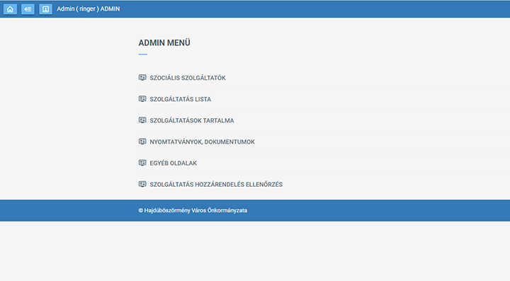
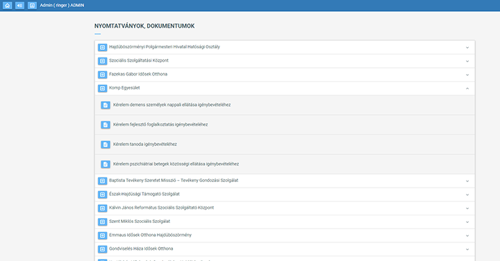
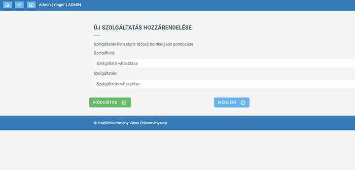
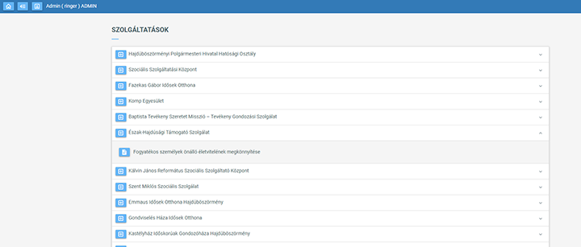

# Hajdúhelp projekt
## Mobil applikáció PHP admin és API backend
## CodeIgiter 3 - PHP - API

A program a Hajdúhelp projekt keretében készült mobil applikációk háttérprogramja, az adminisztrációs felületet biztosítja. Itt lehet az adatokat karbantartani, amiket a mobil applikáció API-kérésekkel lehívhat.

<table>
<tr>
<td></td>
</tr>
<tr>
<td></td>
</tr>
<tr>
<td></td>
</tr>
<tr>
<td></td>
</tr>
</table>